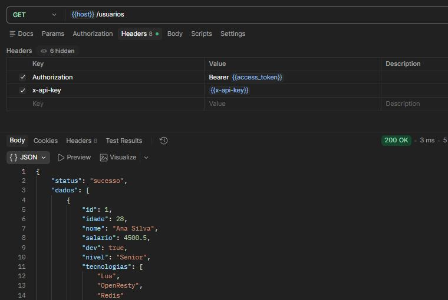
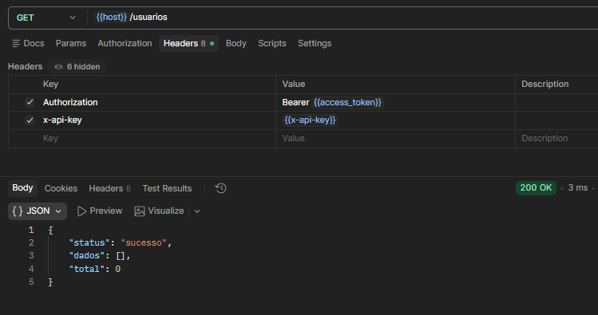
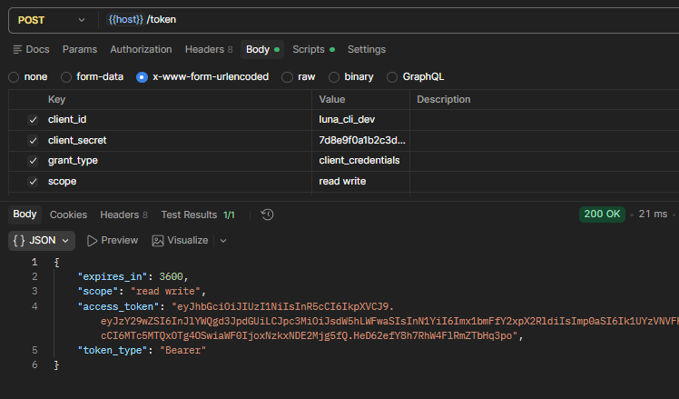
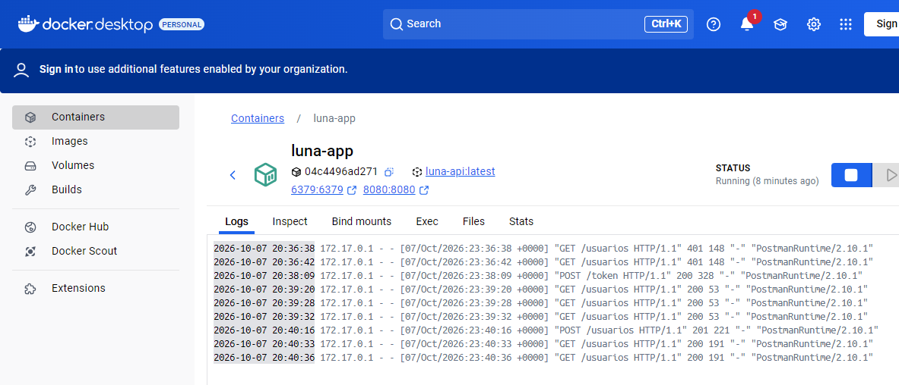

# 🌙 Luna REST API (OpenResty + Lua)

API RESTful de altíssima performance e ultra-baixa latência construída com **Lua** e **OpenResty** (Nginx + LuaJIT), projetada para lidar com um volume massivo de requisições por segundo utilizando processamento não-bloqueante baseado em coroutines.

> ⚡ **Benchmark Local:** Em testes executados via **Docker Desktop (Alpine)**, a API atingiu um tempo de resposta de apenas **2 ms** no endpoint de busca de usuários, demonstrando a eficiência extrema do ecossistema LuaJIT em memória.

---

## 🎯 Destaques do Projeto

* 🚀 **Ultra Performance (2 ms):** Roteamento em C/Nginx com regras compiladas (PCRE2) e execução assíncrona transparente via coroutines.
* 🛡️ **Segurança em Camadas (Zero Trust):** Exige autenticação dupla simultânea por **`x-api-key`** (Base64) e **`Bearer Token`** para máxima proteção dos recursos.
* 🔑 **Padrão OAuth 2.0 & JWT:** Rota `/token` nativa para emissão de JSON Web Tokens (RFC 7519) assinados em `HMAC-SHA256` com tempo de expiração (`exp`, `iat`, `jti`).
* 🧩 **Arquitetura Limpa (MVC / Middlewares):** Separação estrita de responsabilidades em camadas (`Controllers`, `Services`, `Middlewares` e `Utils`).
* ⏱️ **Rate Limiting Nativo (Proteção Anti-DDoS):** Middleware desacoplado em memória RAM controlando o limite de requisições por IP com resposta automática `HTTP 429 Too Many Requests`.
* 🌐 **CORS & Preflight Dinâmico:** Gerenciamento centralizado de políticas de origem (`Cross-Origin`) e requisições `OPTIONS` processadas direto pela camada de middleware Lua.
* 🐳 **Containerização Minimalista:** Imagem Docker otimizada em cima do Alpine Linux com consumo residual de memória RAM.

---

## 📸 Evidências de Testes & Performance

<table>
  <tr>
    <td width="50%">
      
    </td>
    <td width="50%">
      
    </td>
  </tr>
  <tr>
    <td width="50%">
      
    </td>
    <td width="50%">
      
    </td>
  </tr>
</table>

---

## 📁 Estrutura do Projeto

```text
luna-rest-api/
├── .devcontainer/
│   └── devcontainer.json    # Configurações do ambiente de desenvolvimento automatizado
├── .vscode/
│   └── settings.json        # Ajustes de workspace do VS Code
├── conf/
│   └── nginx.conf           # Mapeamento de rotas e configurações de borda do OpenResty
├── db/
│   └── usuarios.json        # Base de dados local para persistência de dados
├── docker/                  # Scripts e arquivos de construção de imagem Docker
├── docs/
│   └── assets/              # Evidências, prints de testes e documentação visual
├── logs/                    # Arquivos de log do servidor Nginx/OpenResty
├── lua/
│   ├── controllers/         # Camada de controle e roteamento HTTP
│   │   ├── auth_controller.lua     # Endpoint de emissão do Token JWT (OAuth 2.0)
│   │   └── usuario_controller.lua  # Endpoints CRUD de usuários
│   ├── middlewares/         # Interceptadores de segurança, controle e tráfego
│   │   ├── auth_middleware.lua     # Validação estrita de credenciais (x-api-key + Bearer JWT)
│   │   ├── cors.lua                # Tratamento dinâmico de origens e requisições Preflight (OPTIONS)
│   │   └── rate_limit.lua          # Controle de requisições por IP (Proteção Anti-DDoS)
│   ├── services/            # Camada de regras de negócio e manipulação dos dados
│   │   └── usuario_service.lua     # Lógica do CRUD e gerenciamento em memória/JSON
│   └── utils/               # Helpers e utilitários da aplicação
│       ├── env.lua          # Utilitário para leitura das variáveis do arquivo .env
│       └── response.lua     # Padronizador de respostas JSON com ordem fixa de atributos
├── .env                     # Variáveis de ambiente e chaves secretas do servidor
├── .gitignore               # Arquivos e pastas ignorados pelo controle de versão
└── README.md                # Documentação oficial do projeto
```

---

## 🚀 Como Executar no GitHub Codespaces

Se estiver configurando o ambiente manualmente sem a automação do `.devcontainer`:

### 1. Instalar Dependências (Apenas na 1ª vez)

```bash
# Adiciona o repositório oficial do OpenResty
wget -qO - [https://openresty.org/package/pubkey.gpg](https://openresty.org/package/pubkey.gpg) | sudo gpg --dearmor -o /etc/apt/trusted.gpg.d/openresty.gpg
echo "deb [http://openresty.org/package/ubuntu](http://openresty.org/package/ubuntu) jammy main" | sudo tee /etc/apt/sources.list.d/openresty.list

# Atualiza e instala os pacotes
sudo apt-get update && sudo apt-get install -y openresty mysql-server
```

---

## 🐳 Executando com Docker

Se preferir rodar a aplicação em um ambiente isolado na sua máquina utilizando Docker Desktop:

### 1. Gerar a Imagem Docker
```bash
docker build -f docker/Dockerfile -t luna-api:latest .
```

### 2. Iniciar o Container
```bash
docker run -d --name luna-app -p 8080:8080 luna-api:latest
```

### 3. Testar a API Localmente
```bash
curl http://localhost:8080/usuarios
```

### 4. Parar e Remover o Container
```bash
docker stop luna-app && docker rm luna-app
```

---

## 🛠️ Gerenciando o Servidor

### Iniciar o servidor
```bash
openresty -p . -c conf/nginx.conf
```

### Recarregar alterações (Hot-Reload)
Sempre que alterar arquivos `.lua` ou `.conf`, use para aplicar sem derrubar o servidor:
```bash
openresty -p . -c conf/nginx.conf -s reload
```

### Parar o servidor
```bash
openresty -p . -c conf/nginx.conf -s stop
```

### Forçar encerramento (se a porta 8080 estiver ocupada)
```bash
sudo killall nginx openresty
```

---

## 🧪 Endpoints da API

| Método | Rota | Autenticação | Descrição |
| :--- | :--- | :--- | :--- |
| **POST** | `/token` | Pública | Gera o Bearer Token JWT (Padrão OAuth 2.0) |
| **GET** | `/usuarios` | `x-api-key` + `Bearer Token` | Lista todos os usuários cadastrados |
| **POST** | `/usuarios` | `x-api-key` + `Bearer Token` | Cadastra um novo usuário |
| **PUT** | `/usuarios/:id` | `x-api-key` + `Bearer Token` | Atualiza os dados de um usuário pelo ID |
| **DELETE** | `/usuarios/:id` | `x-api-key` + `Bearer Token` | Remove um usuário pelo ID |

---

## 💻 Exemplos de Requisições (`curl`)

**1. Gerar Bearer Token (OAuth 2.0):**
```bash
curl -X POST http://localhost:8080/token \
  -H "Content-Type: application/x-www-form-urlencoded" \
  -d "client_id=luna_cli_dev&client_secret=7d8e9f0a1b2c3d4e5f6a7b8c9d0e1f2a3b4c5d6e&grant_type=client_credentials&scope=read write"
```

**2. Listar Usuários:**
```bash
curl http://localhost:8080/usuarios \
  -H "x-api-key: bHVuYV9hcGlfdjFfc2VjcmV0X2FjY2Vzc19rZXlfMjAyNg==" \
  -H "Authorization: Bearer <SEU_TOKEN_JWT>"
```

**3. Criar Usuário:**
```bash
curl -X POST http://localhost:8080/usuarios \
  -H "x-api-key: bHVuYV9hcGlfdjFfc2VjcmV0X2FjY2Vzc19rZXlfMjAyNg==" \
  -H "Authorization: Bearer <SEU_TOKEN_JWT>" \
  -H "Content-Type: application/json" \
  -d '{"nome": "Victor", "dev": true}'
```

**4. Atualizar Usuário:**
```bash
curl -X PUT http://localhost:8080/usuarios/1 \
  -H "x-api-key: bHVuYV9hcGlfdjFfc2VjcmV0X2FjY2Vzc19rZXlfMjAyNg==" \
  -H "Authorization: Bearer <SEU_TOKEN_JWT>" \
  -H "Content-Type: application/json" \
  -d '{"nome": "Victor M."}'
```

**5. Apagar Usuário:**
```bash
curl -X DELETE http://localhost:8080/usuarios/1 \
  -H "x-api-key: bHVuYV9hcGlfdjFfc2VjcmV0X2FjY2Vzc19rZXlfMjAyNg==" \
  -H "Authorization: Bearer <SEU_TOKEN_JWT>"
```